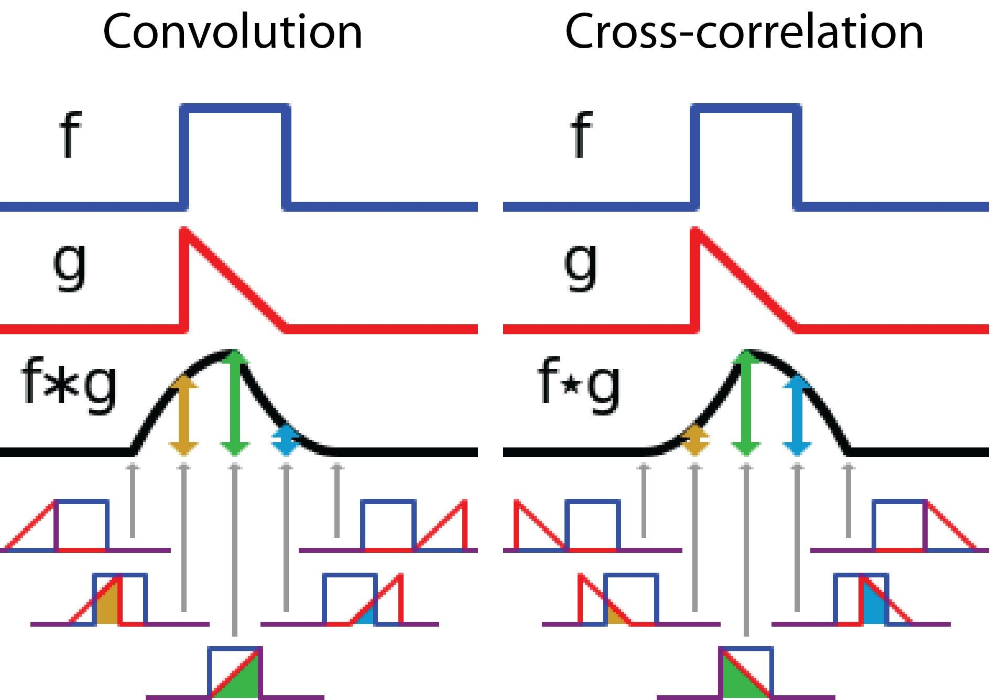

 

# ✨Introduction to Image Classification using Convolutional Neural Networks (CNNs)

Deep Learning is one of the most fascinating fields of Artificial Intelligence, especially because it adds another dimension of Multimodality to learn from the World around us. As we probably have seen before, there are many different ways of studying images'content, and today we will delve even deeper with the interesting concepts of Convolutional Neural Networks alias CNNs.

## Prerequisites
As image data are considerably voluminous, sourcing them and processing them usually require consequent processing power and energy consumption. We may collect images from the Internet thanks to Big Data, social media, streaming multimedia content, movies, photography, etc., hence the need for parallel-computing, which leads us to the extensive usage of TPUs and GPUs.

This added sophistication is consequently resource-intensive, therefore we choose to setup our environment around Keras and Tensorflow which are popular powerful libraries for Image Processing.

[In some projects, we may encounter uses of other libraries such as Theano, Scikit-learn (image) and Caffe...and other ecosystems we will briefly mention later.]

## Image Processing Techniques
There are many Image Processing Techniques we can perform, just by mastering Convolutional Neural Networks basics, before gradually embracing different levels of complexity. We can cite for instance:

- ✔ Image Enhancement: to improve image quality by reducing blur or adjusting standard parameters such as brightness, contrast, and sharpness,
- ✔ Image Restoration: to restore degraded images (antique black and white photos for eg.) using methods like inverse filtering, 🎞
- ✔ Image Segmentation: to divide an image into "semantic/meaningful" parts according to the pixel disrtibution, using techniques like thresholding and edge detection, (eg. self-driving cars),
- ✔ Image Compression: to reduce the file size through lossy or lossless methods,
- ✔ Image Generation: it used GANs (Generative Adversarial Networks) to create new image or enhance existing ones,
- ✔ Morphological Processing: Alter image structures based on shape.

## Lesson Overview :pencil2:
Without further ado, let's explore the essential concepts behind image classification using Convolutional Neural Networks (CNNs), a key element in the field of computer vision. For now, we’ll break down how CNNs work, focusing on critical components such as:
* Convolution, 
* Filters, 
* and Pooling layers. 

Additionally, we’ll look at practical applications of CNNs in tasks like object detection and image classification, providing a clear understanding of their significance in real-world scenarios.

## Learning Objectives :notebook:
By the end of this lesson, we will be able to:

- Explain the basic structure and functioning of Convolutional Neural Networks (CNNs).
- Describe the role of convolution, filters, and pooling layers in CNNs.
- Identify key use cases for CNNs in image classification and object detection.
- Apply the concepts learned to analyze a simple CNN architecture.
- Discuss the advantages and limitations of using CNNs for image classification tasks.

## Key Definitions and Examples :key:
As we know it, digital images are made of small units known as pixels. Each one of them is essentially a number, which in fact represents the intensity of light detected at that point, often displayed as a colored square for the sake of visualization.
In colored images (in opposition to Black and White images), they are typically represented by three values corresponding to the intensities of Red, Green and Blue (RGB), the basic color components allowing a wide ranges of hues. To simplify, the resolution of images is the determined by the total number of pixels contained, computed by multiplying its Width and Height in pixels.

### What are Convolutional Neural Networks (CNNs)? 
Convolutional Neural Networks (CNNs) are a type of deep learning model specifically designed to process structured data like images. They are advanced machine learning vision models, we often encounter beside vision transformers (ViTs). 

CNNs leverage a mathematical operation called convolution, which allows them to automatically identify patterns and features within images through multiple processing layers. 

To visualize simply as CNNs: 

### Examples
Think of an image as a 2D matrix filled with pixel values. A CNN applies a filter (or kernel) over this matrix to perform convolution, extracting features such as edges or textures. For instance, when a 3x3 filter is applied to an image, it slides across the matrix, performing element-wise multiplication and summing the results to generate a feature map that highlights specific characteristics.

### What is a Convolution?
A Convolution is a mathematical operation that combines two functions to create a third function, illustrating how one function modifies another. 

We can also understand convolutions as a series of "overlapping impulse responses", of how a given system, in our case a source image, responds to various inputs (we sometimes model an impulse in maths as the function of Dirac (delta)). In Computer Vision and CNNs, we use ReLU (Rectified Linear Unit) as activation function to introduce non-linearity.

### Activation Functions
To enable the model to learn complex patterns, several activation functions are used to introduce non-linearity. The most prevalent are:
- ReLU: The default choice for hidden layers due to its computational efficiency and ability to mitgate the vanishing gradient problem. It outputs the input directly if positive, otherwise zero.
- Sigmoid: used in binary classification, it squashes outputs between 0 and 1, making it suitable for probability estimation.
- Tanh (Hyperbolic Tangent): outputs values between -1 and 1, providing a zero-centered output, beneficial for certain applications (symetrical gradients distribution for faster convergence during trainings).
- Softmax: typically used in the output layer for mutliclass classification problems, as it produces a probability distribution over multiple classes. 

For precision, in practice the term "convolution" is the theoretical operation involving flipping the kernel before applying it to the input, the term is  used interchangeably to refer to a range of operations including the  "cross-correlation" which is in fact the most efficient convolution operation for direct feature extraction.

In CNNs, convolution involves sliding a filter over an input image to compute feature maps. In the following image (colored image RGB)the notion of stride is invoked to refer to the number of steps a kernel does to slide from row/column to row/column to achieve the objective.

📌There are many types of convolution: single channel, multi-channel, 1*1 convolutions, 3D, etc

-**Example:**
For example, if we have an input image with pixel values and a 3x3 filter designed to detect vertical edges, the convolution operation will emphasize areas in the image where there are significant changes in pixel intensity vertically. This results in a new feature map that indicates where vertical edges are present.

### What are Filters?
In Convolutional Neural Networks, filters are those small matrices (kernels) that perform the convolution operations on the input image. They are essential for extracting features by detecting patterns like edges and textures as they "slide" across the input. 

### Use
Each filter has been trained to recognize distinctive features, which is a core task in image classification and object detection, which we will see through the exercises.

They also enable translation invariance, allowing the network to recognize specific patterns regardless of their location in the image, help reduce dimensionality, enhancing computational efficiency and robustness against overfitting.

### Key CNN Architectures
Famous CNNs names of architecture include:

- **LeNet-5** (1998): Developed by Yann LeCun for handwritten digit recognition, featuring 7 layers including convolutional and pooling layers.
- **AlexNet** (2012): Created by Alex Krizhevsky et al., it won the ILSVRC with a deep architecture of 8 layers, utilizing ReLU activation.
- **ZFNet** (2013): An improved version of AlexNet by Matthew Zeiler and Rob Fergus, focusing on hyperparameter adjustments.
- **VGGNet** (2014): Introduced by Karen Simonyan and Andrew Zisserman, known for its depth (16 or 19 layers) and small filters.
- **ResNet** (2015): Developed by Kaiming He et al., it introduced residual learning to address the vanishing gradient problem in deep networks.

### What are Pooling Layers?
Pooling layers are integral to CNNs as they reduce the spatial dimensions of feature maps while preserving important information. This **down-sampling** process helps lower computational demands and mitigate overfitting by summarizing features detected by previous layers.

-**Pooling Layers Examples:**
A common pooling method is Max Pooling, which selects the maximum value from each patch of the feature map defined by a specified window size (e.g., 2x2). For instance, if we apply Max Pooling on a 4x4 feature map using a 2x2 window, we would reduce it to a 2x2 matrix by taking the maximum value from each 2x2 region. (selecting maximum values from each pooling region and preserving salient features)

Other Pooling Methods:
- Average Pooling: Computes the average value, retaining more information than the former but potentially "diluting" key features.
- Global Pooling: reducing each feature map to a single value, summarizing the entire map.
- Mixed-Pooling and Super-Pixel Pooling, emerging techniques aimed at improving performance in divese applications of image classification and object detection like in our case. 

### Tools and Ecosystems:
  Google TensorFlow and Keras are the most used frameworks for building CNNs, in image classification and object detection use cases. But there are also other popular libraries:
  - Pytorch: prefferred for its dynamic computation graph, useful for image segmentation and object detection with CNN architecture like ResNet,
  - KNIME Analytics Platform: a code-free environment to implement CNN for image classification tasksfor deriving useful information from images.

## CONVOLUTION VS POOLING LAYER
N.B: Convolutions and Pooling layers serve distinct but complementary roles in CNNs:
- Convolution Layer: applies filter to the input data, detecting patterns and features, generates feature maps by sliding a filter over the input, performing element-wise multiplication and summing the results. The convolutional layer has learnable parameters (weights) that are updated during training to optimize feature extraction.

- Pooling Layer: following convolutional layers, it reduces the spatial dimensions of the feature maps, which decreases the number of parameters and computations required, helping to mitigate overfitting. Pooling operations, like Max Pooling (seen before) and Average Pooling, summarize features within a region without learnable parameters, providing translational invariance.

### Key Takeways 
In summary, convolution layers extract detailed features while pooling layers simplify the representation for more efficient processing.

    
## Additional Resources :clipboard:

We have seen a brief overview of CNNs. Hope you have enjoyed it so far! Next, we may experiment with other flexible frameworks such as AutoKeras to handle various formats or automate model selections, while also exploring techniques for manipulating CNNs in tasks such as image regression for quality assessment, grading items, or estimating age from facial features.

If you would like to study CNNs concepts a bit more before the class, or would benefit from some remedial studying, please utilize the resources below:
- [Deep Learning for Computer Vision with Python](https://www.pyimagesearch.com/deep-learning-computer-vision-python-book)
- [Stanford CS231n: Convolutional Neural Networks for Visual Recognition](http://cs231n.stanford.edu/)
- [Deep Learning for Computer Vision, a concise yet rich booklet by  Ava Soleimany](
http://introtodeeplearning.com/2019/materials/2019_6S191_L3.pdf)
- [Andrew Ng Notes on CNNs by Ashish Patel](https://github.com/ashishpatel26/Andrew-NG-Notes/blob/master/andrewng-p-4-convolutional-neural-network.md/)
- [For Math Lovers: A Gentle intro on CNNs](https://towardsdatascience.com/gentle-dive-into-math-behind-convolutional-neural-networks-79a07dd44cf9)

  (Image Source: Convolution maths: Illarion's Notes..) 

